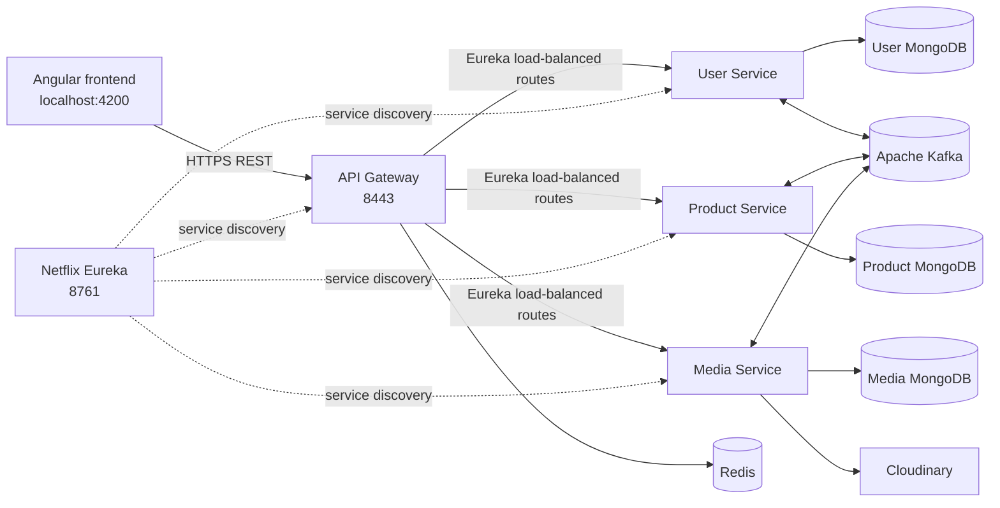
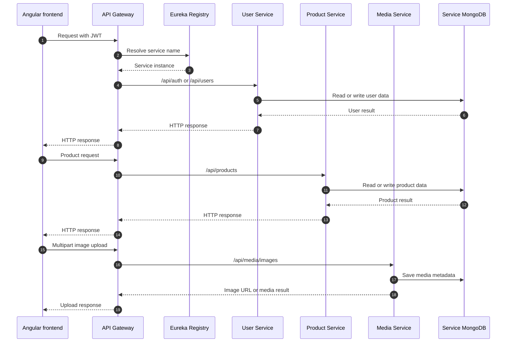
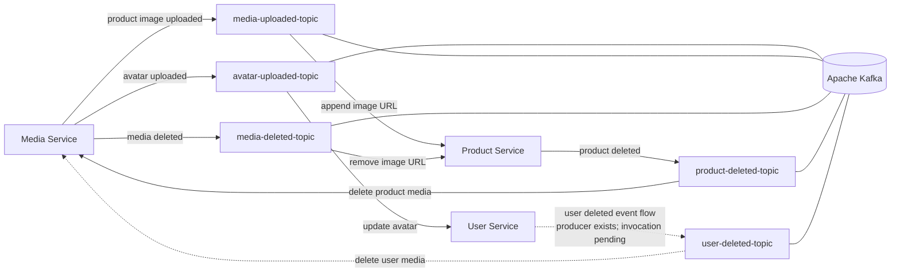
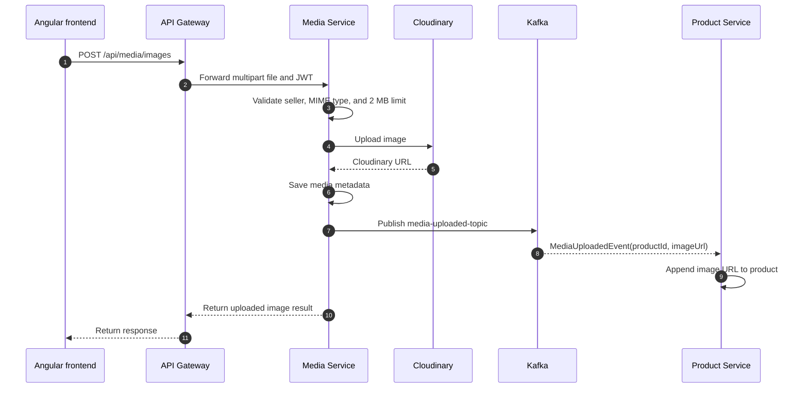
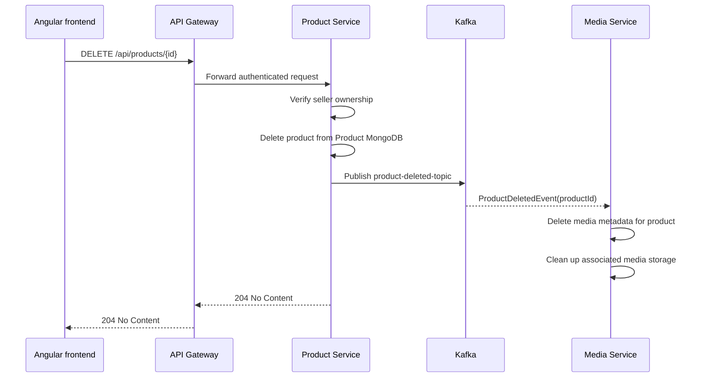

# Buy Platform

Buy is a marketplace application built as a collection of Spring Boot
microservices and an Angular frontend. Users can register as clients or
sellers. Clients browse products, while sellers manage their products and
associated images.

The project uses REST for request/response operations and Apache Kafka for
events that cross service boundaries. Each business service owns its own
MongoDB database. The API Gateway is the only public backend entry point.

## Architecture



### How the services work together

The normal request path is synchronous. The browser sends one request to the
gateway, the gateway discovers the correct service through Eureka, and that
service reads or changes only its own data. The response then travels back
through the gateway to the browser.



The three service calls use separate data stores even when they participate in
one user workflow. Kafka connects the follow-up work that does not need to
block the original HTTP response.

### Kafka event architecture

The event flow below shows the implemented producers and consumers. Each
consumer uses its own group so a service receives the events relevant to its
responsibility.



#### Example: product image upload



#### Example: product deletion cleanup



### Runtime components

| Component | Responsibility | Default port |
| --- | --- | ---: |
| Angular frontend | Authentication screens, product browsing, seller dashboard | 4200 |
| API Gateway | TLS termination, CORS, routing, rate limiting, public entry point | 8443 |
| User Service | Registration, login, profiles, roles, JWT creation | 8081 |
| Product Service | Product CRUD, pagination, seller ownership checks | 8082 |
| Media Service | Image validation, Cloudinary upload/delete, media metadata | 8083 |
| Eureka Registry | Service registration and discovery | 8761 |
| Redis | Gateway request-rate limiter state | 6379 |
| Kafka | Domain event transport | 9092 / 29092 |
| User MongoDB | User Service persistence | 27017 |
| Media MongoDB | Media Service persistence | 27018 (host) |
| Product MongoDB | Product Service persistence | 27019 (host) |
| Kafka UI | Local Kafka inspection | 8085 |

## Main design strategies

### 1. Microservices and bounded ownership

The backend is split by business capability:

- **User Service** owns users, credentials, roles, profiles, and JWT issuance.
- **Product Service** owns product data and seller-to-product ownership.
- **Media Service** owns media metadata and image storage operations.
- **API Gateway** owns the external HTTP boundary and routing concerns.
- **Registry** owns service discovery, not business data.

Services are independently buildable and packaged with their own Maven project
and Dockerfile.

### 2. Database-per-service

Each business service has a separate MongoDB database and collection. Services
do not use database foreign keys across service boundaries. Instead, they store
logical identifiers:

```text
User (1) ---- owns ---- (many) Product (1) ---- has ---- (many) Media
```

- A product stores `sellerId`, referring to a user in User Service.
- Product image references are stored on the product, while image metadata is
	stored by Media Service.
- Cross-service ownership and existence checks happen in application code.

This keeps service data isolated and allows each service to evolve its schema
independently.

### 3. Service discovery and gateway routing

Services register with Eureka. The gateway routes public paths to logical
service names using load-balanced URIs such as `lb://USER-SERVICE`.

External clients should call the gateway rather than calling backend services
directly:

```text
/api/auth/**       -> User Service
/api/users/**      -> User Service
/api/products/**   -> Product Service
/api/media/**      -> Media Service
```

This gives one place to configure TLS, CORS, rate limits, and route policy.

### 4. Hybrid communication: REST plus events

REST is used when the caller needs an immediate response:

- Angular calls the gateway for authentication and product operations.
- User Service delegates media-related work to Media Service when required.
- Media Service uses a product client for ownership-related checks.

Kafka is used for decoupled side effects and cleanup:

- `avatar-uploaded-topic`
- `user-deleted-topic`
- `media-uploaded-topic`
- `media-deleted-topic`
- `product-deleted-topic`

For example, when media is uploaded for a product, Media Service publishes a
media-uploaded event. Product Service consumes it and links the returned image
reference to the product. When a product is deleted, a product-deleted event
can trigger media cleanup without making Product Service manage Cloudinary
directly.

Kafka consumers use Spring Kafka listener containers and service-specific
consumer groups. This allows consumers to process their own copy of an event
and supports concurrent partition processing when configured.

### 5. JWT authentication, roles, and ownership

User Service authenticates credentials and returns a JWT. The token subject is
the authenticated user's identifier. The frontend stores the token and an HTTP
interceptor adds it to API requests.

Authorization has two layers:

- **Role authorization:** `CLIENT` can browse; `SELLER` can manage products and
	media.
- **Resource ownership:** Product Service compares the authenticated subject
	with the product's `sellerId` before update or delete. Media deletion also
	verifies the owning seller.

Passwords are hashed with BCrypt and are never returned in user responses.

### 6. Validation and defensive media handling

The backend uses Jakarta validation for request DTOs. Product rules include a
positive price and a non-negative quantity. Media uploads are restricted to
images, have a 2 MB limit, and use content-type sniffing to reject payloads
that do not match an image.

The frontend also uses Angular Reactive Forms and route guards. It provides
client-side feedback, but backend validation remains authoritative.

### 7. Gateway protection

The gateway enables CORS for the Angular development origin and applies Redis
backed token-bucket rate limiting:

- User/authentication routes: replenish rate 10, burst capacity 20.
- Product routes: replenish rate 10, burst capacity 20.
- Media routes: replenish rate 30, burst capacity 50.

Redis makes limiter state shareable between gateway instances, unlike an
in-memory limiter.

### 8. External media storage

Media Service stores image metadata in MongoDB and the actual image in
Cloudinary. Other services receive stable media references or URLs rather than
handling Cloudinary credentials or storage implementation details.

## Data model

### User collection

Database: `user_service`, collection: `users`.

| Field | Meaning |
| --- | --- |
| `id` | User identifier and JWT subject |
| `name` | Unique display/login name |
| `email` | Unique email address |
| `password` | BCrypt hash |
| `role` | `ROLE_CLIENT` or `ROLE_SELLER` |
| `avatar` | Media URL or media identifier |

### Product collection

Database: `product_service`, collection: `products`.

| Field | Meaning |
| --- | --- |
| `id` | Product identifier |
| `name` | Product name |
| `description` | Optional description |
| `price` | Positive product price |
| `quantity` | Available quantity, zero or greater |
| `sellerId` | Logical reference to the owning user |
| `imageUrls` | References to media supplied by Media Service |

### Media collection

Database: `media_service`, collection: `media`.

| Field | Meaning |
| --- | --- |
| `id` | Media identifier |
| `imagePath` | Cloudinary path or URL |
| `productId` | Logical reference to the related product |

## API inventory

All paths below are intended to be called through the gateway.

### Authentication and users

| Method | Path | Purpose |
| --- | --- | --- |
| `POST` | `/api/auth/register` | Register a client or seller |
| `POST` | `/api/auth/login` | Authenticate and receive a JWT |
| `GET` | `/api/users/me` | Read the authenticated profile |
| `PUT` | `/api/users/me` | Update the authenticated profile |

### Products

| Method | Path | Access |
| --- | --- | --- |
| `GET` | `/api/products` | Authenticated users |
| `GET` | `/api/products/{id}` | Authenticated users |
| `GET` | `/api/products/my?page=0&size=10` | Seller |
| `POST` | `/api/products` | Seller |
| `PUT` | `/api/products/{id}` | Owning seller |
| `DELETE` | `/api/products/{id}` | Owning seller |

### Media

| Method | Path | Purpose |
| --- | --- | --- |
| `POST` | `/api/media/images` | Upload one or more images |
| `GET` | `/api/media/images/{id}` | Resolve media metadata and URL |
| `DELETE` | `/api/media/images?url=...` | Delete an image owned by the seller |

The upload request uses multipart field `media` and accepts an optional
`productId` and `type`.

## Frontend architecture

The Angular application is organized around feature areas:

- `auth`: login and registration flows.
- `home`: authenticated product browsing.
- `product`: product details.
- `dashboard`: seller operations.
- `core`: layouts, guards, interceptors, and shared application services.

The router uses:

- `guestGuard` for login and registration pages.
- `authGuard` for authenticated pages.
- `roleGuard` for seller-only dashboard access.
- `authInterceptor` to attach JWT credentials and handle unauthorized
	responses.

The frontend uses Angular Reactive Forms, Angular Material, RxJS, and
`jwt-decode`. Run it separately from the backend with `npm start`.

## Running locally

### Prerequisites

- Java and Maven-compatible JDK for the Spring Boot services.
- Docker and Docker Compose.
- Node.js and npm for Angular.
- Environment values for JWT, MongoDB, Cloudinary, and the gateway keystore.

### Option A: Docker Compose

The root compose file starts infrastructure and containerized backend
services:

```bash
docker compose up --build
```

The gateway is exposed at `https://localhost:8443`. Kafka UI is available at
`http://localhost:8085`. The frontend still runs separately:

```bash
cd frontEnd
npm install
npm start
```

The compose setup expects the service `.env` files referenced in
`docker-compose.yml`, plus the gateway PKCS12 keystore configured by the
gateway properties.

### Option B: local Spring Boot processes

The helper script starts the registry and backend processes, creates logs under
`docs/logs`, and manages PID files under `docs/.run`:

```bash
./run-all.sh start
./run-all.sh status
./run-all.sh logs api-gateway
./run-all.sh stop
```

Each service can also be run independently from its directory with its Maven
wrapper, for example:

```bash
cd Backend/product-service
./mvnw spring-boot:run
```

When running outside Docker, update environment values and Kafka/MongoDB host
names as needed. The default local backend ports are 8761, 8081, 8082, and
8083. Note that `run-all.sh` currently expects the gateway on port 8080 while
the gateway configuration and Docker Compose expose it on 8443; align these
values before using the script for a complete local run.

## Project structure

```text
buy-01/
├── Backend/
│   ├── api-gateway/       # Public gateway, TLS, CORS, routing, rate limits
│   ├── media-Service/     # Image and media operations
│   ├── product-service/   # Product operations and ownership
│   ├── registry/          # Eureka server
│   └── user-service/      # Authentication and profiles
├── frontEnd/              # Angular application
├── docs/project-docs/     # Database, Kafka, and project audit documents
├── docker-compose.yml     # Containerized local environment
└── run-all.sh             # Local process lifecycle helper
```

## Current implementation status

The main authentication, product CRUD, seller ownership, image upload, Kafka
integration, Dockerfiles, frontend guards, and gateway rate limiting are
implemented. The project audit in `docs/project-docs/todolist.md` records the
remaining work. The most relevant gaps are:

- User deletion does not currently invoke the user-deleted producer flow.
- Media listing by `productId` is not exposed yet.
- Media caching headers (`ETag` and `Cache-Control`) are not implemented.
- Health endpoints are not consistently exposed by every service.
- Some media exception handling and frontend upload validation are incomplete.
- The gateway keystore and some required environment files are not present in
	the repository, so a clean Docker startup requires local configuration.
- API and security test coverage is still limited, especially for Kafka and
	cross-service flows.

For the detailed database model, see `docs/project-docs/database-design.md`.
For Kafka consumer flow notes, see `docs/project-docs/kafka-docs.md`. For the
full implementation audit, see `docs/project-docs/todolist.md`.

## Engineering principles

1. Keep business data inside the service that owns it.
2. Use the gateway as the public boundary.
3. Use synchronous REST when the caller needs an immediate result.
4. Use Kafka for decoupled updates, integration, and cleanup.
5. Derive identity from the verified JWT, never from a client-supplied seller
	 identifier.
6. Validate at both the API boundary and the domain/service layer.
7. Keep secrets in environment variables and never commit credentials.
8. Prefer observable, independently deployable services over shared database
	 coupling.
